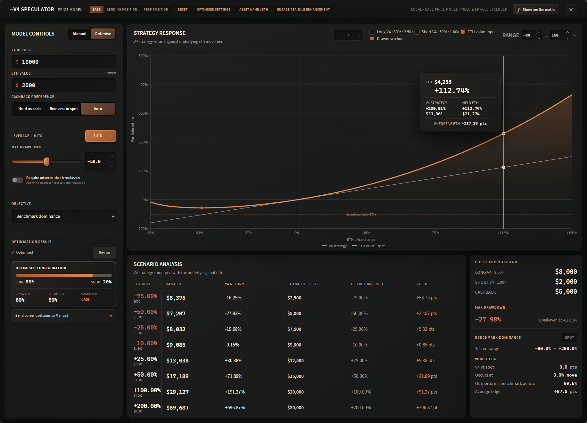
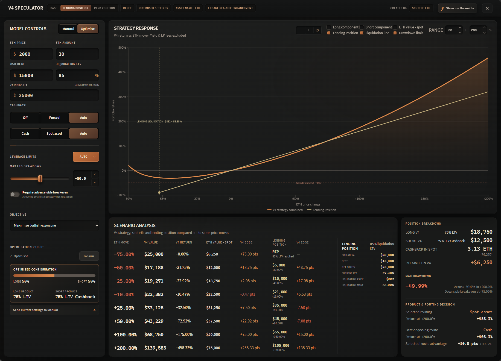
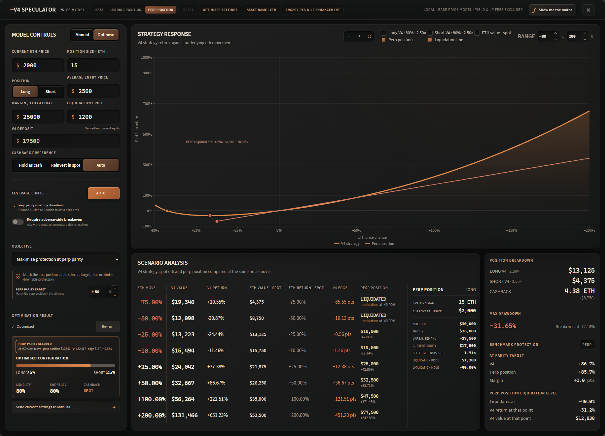
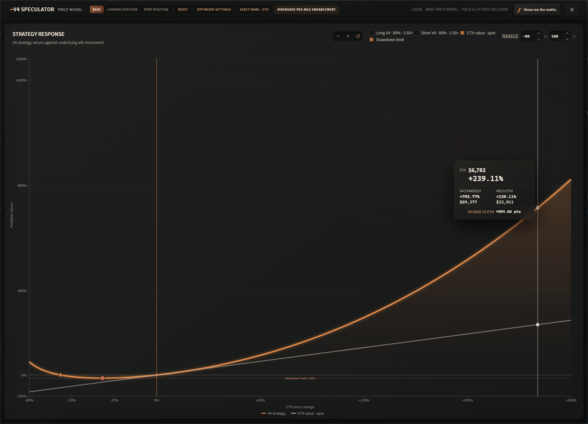

# V4 Speculator / Price Model

An independent Windows desktop modelling and optimisation tool for exploring potential Peapods Finance V4 strategy behaviour across different underlying asset price moves.

V4 Speculator lets you model Long V4 and Short V4 allocations, leverage, eligible Long cash-out treatment, and drawdown constraints, then compare the resulting response curve against spot, leveraged lending positions, and perpetual futures.

> **Web version:** The web version is an experimental beta release with the latest feature set. It may offer capabilities ahead of the desktop version, but is also more likely to experience instability or breaking changes while development continues. Try it at [scuttl-e.github.io/v4-speculator-calculator](https://scuttl-e.github.io/v4-speculator-calculator/).

> [!IMPORTANT]
> **Unofficial V4 model**
>
> <small>This project is **independent and unofficial**; it is not produced by, affiliated with, or endorsed by the Peapods Finance team. The V4 calculations are **close estimates reconstructed from publicly released information**, including charts, strategy examples, posts, and technical material. Where complete mechanics have not been documented, the model uses interpolation, extrapolation, or inferred behaviour—particularly for arbitrary LTV levels and parts of the short-side model. Treat all figures as **scenario estimates rather than authoritative V4 outputs** until complete official documentation, formulas, and implementation details are published.</small>

---

## What it does

V4 Speculator models how a V4 position could respond as the underlying asset moves through a user-defined price range.

It can:

- combine Long V4 and Short V4 positions;
- model leverage up to the currently supported V4 range;
- account for the modelled eligible Long V4 cash-out structure;
- compare holding genuine cash-out as cash with reinvesting it into the underlying asset;
- constrain strategies by maximum drawdown and optional leverage limits;
- optimise allocations, leverage, and cash-out treatment for different objectives;
- compare V4 against spot, leveraged lending positions, and perpetual futures;
- model lending and perp liquidation boundaries;
- show scenario returns across a range of asset-price moves;
- analyse breakeven, downside recovery, cash-out switch points, parity protection, and benchmark dominance; and
- expand the Strategy Response chart into an immersive PEA-NILE analytical view.

The aim is not to predict the price of an asset. The app asks a different question:

**Given a range of possible prices, what kind of V4 configuration produces the risk/return profile you actually want?**

---

## Comparison modes

The app has three main comparison modes.

### Base

The standard V4 modelling environment.

Use Base when you want to explore V4 on its own or compare it directly against simply holding the underlying asset.

Typical uses include:

- designing a bullish or bearish V4 strategy;
- balancing Long V4 and Short V4;
- constraining maximum drawdown;
- comparing V4 with spot;
- testing eligible cash-out treatment; and
- finding configurations that perform well across a broad price range.

This is the simplest mode when there is no existing leveraged position to reproduce or replace.



*Base mode — optimise a standalone V4 allocation and inspect its response against holding the underlying asset.*

### Lending Position

Models an existing collateralised lending position alongside V4.

Inputs describe the lending position, including:

- underlying asset amount;
- current asset price;
- USD debt; and
- liquidation LTV.

From these values, the app derives collateral value, net equity, current LTV, liquidation price, and liquidation asset move.

The **net equity** of the lending position becomes the equivalent capital available to the V4 strategy, allowing a like-for-like comparison.

This mode is useful for questions such as:

- Can V4 reproduce the upside of my leveraged lending position with less downside?
- What does V4 look like at the point where my lending position would liquidate?
- Can V4 maintain parity with the lending position at my target price?
- Which strategy has the stronger return profile over the full valid price range?

The lending comparator stops at its liquidation boundary rather than being treated as a zero-value position beyond liquidation.



*Lending Position mode — compare V4 with collateral, debt, and the supplied lending-liquidation boundary.*

### Perp Position

Compares V4 against an existing linear perpetual-futures position.

The perp comparator uses:

- current or mark price;
- average entry price;
- position side and size;
- margin or collateral;
- current unrealised PnL; and
- a user-supplied liquidation price.

The app derives the perp's current equity from its margin and unrealised PnL. That current equity becomes the equivalent V4 deposit, answering a like-for-like question: what happens if the position is closed now and its available equity is redeployed into V4?

Liquidation is treated as a hard boundary using the supplied exchange liquidation price. The app does not attempt to recreate venue-specific liquidation mechanics.

This mode is useful for questions such as:

- How much of the perp's upside can V4 reproduce?
- What does V4 retain at the point where the perp would liquidate?
- Can V4 match a perp at a target while reducing downside?
- How consistently does V4 outperform the perp before liquidation?

Funding, trading fees, and other time-dependent perp costs are currently outside the base price model.



*Perp Position mode — compare V4 with an existing perp’s current equity, directional exposure, and supplied liquidation price.*

---

## Optimiser

Manual mode lets you choose the configuration yourself.

**Optimise** searches the available Long V4 and Short V4 allocation, leverage, and eligible cash-out choices to find a configuration suited to a particular objective while respecting the selected constraints.

The shipped default configurations include precomputed example results for each valid mode/objective combination, so first-time users can inspect the response curves immediately. For any changed setting, optimisation runs only when explicitly requested; changing a relevant input marks the displayed result as stale rather than silently recalculating it.

### Maximise Bullish Exposure

Optimises for the strongest V4 payoff at a selected **positive underlying price target**.

Maximum Drawdown acts as the main risk constraint. Rather than simply choosing 100% maximum-leverage Long V4, the optimiser may introduce Short V4 exposure, lower leverage, or alter eligible cash-out treatment if doing so produces the best feasible result.

In simple terms:

**Get as much upside as possible without exceeding the downside limit you set.**

The Bullish analysis can also identify the **Cash-out Switch Point** where holding eligible cash-out as cash versus reinvesting it into spot becomes the more efficient configuration as permitted drawdown changes.

### Maximise Bearish Exposure

Optimises for the strongest V4 payoff at a selected **negative underlying price target**, subject to the active risk constraints.

Because the short-side V4 response can be convex, the worst point of the strategy does not necessarily occur at the most extreme asset decline. A strategy may fall into an intermediate trough and then recover strongly as the underlying continues lower.

The **Downside Recovery** analysis shows:

- where that trough occurs;
- the V4 return at the trough;
- the selected bearish target;
- the return reached at that target; and
- the total recovery between the two.

In simple terms:

**Optimise for a major downside move while showing the intermediate pain required to reach the resulting tail payoff.**

### Spot Parity / Protection

Finds a V4 configuration that meets or exceeds the spot position at the selected target while seeking better protection elsewhere.

The resulting analysis compares:

- V4 return at the parity target;
- spot return at the same target;
- parity margin;
- V4 maximum drawdown;
- spot maximum drawdown; and
- protection gained.

In simple terms:

**Keep the target performance of spot while trying to improve the downside profile.**

### Lending Position Parity

Available in Lending Position mode.

The optimiser searches for a V4 configuration that meets or exceeds the lending position at the selected target while improving its risk characteristics where possible. The analysis also shows the V4 position at the lending position's liquidation level.

In simple terms:

**Match the leveraged lending position where you care about its return, then see what protection V4 can provide around the rest of the curve.**

### Perp Position Parity

Available in Perp Position mode.

Works on the same principle as Lending Position Parity, but uses the perpetual-futures position as the target comparator. The analysis compares V4 and the perp at the parity target and shows the V4 position at the perp's supplied liquidation level.

In simple terms:

**Match the perp where you want the exposure while comparing what survives when the perp reaches liquidation.**

### Benchmark Dominance

Benchmark Dominance is a different kind of optimisation.

Instead of optimising for one selected target, it evaluates V4 against the relevant comparator **across the entire valid tested price range**.

The comparator is:

- **Base:** Spot
- **Lending Position:** Lending position
- **Perp Position:** Perp position

At every tested price:

```text
Edge = V4 return - benchmark return
```

For every candidate V4 configuration, the optimiser finds its **worst edge** anywhere in the tested range. It then searches for the configuration that makes that worst result as strong as possible.

If several configurations have effectively the same worst edge, the optimiser prefers:

1. the higher average edge;
2. then the lower maximum drawdown.

For lending and perp comparisons, the tested range ends at liquidation. The model never treats a liquidated comparator as suddenly being worth zero and then continues scoring V4 against it.

The resulting analysis shows:

- the effective tested range;
- the worst V4 edge over the comparator;
- where that weakest point occurs;
- how much of the tested range V4 outperforms the comparator across; and
- average V4 edge across the range.

In simple terms:

**Rather than asking V4 to win at one particular price, make its weakest performance against the benchmark as strong as possible across the whole usable range.**

---

## Risk and strategy controls

### Maximum Drawdown

Sets the maximum isolated-leg loss contribution the optimiser is allowed to accept, capped at **99%**. Long and Short contributions are checked separately within the configured **Analysis Range**, so one leg cannot hide losses in the other.

The control supports **0.1 percentage-point increments**, allowing calculated thresholds such as `-46.6%` to be used directly without changing the optimiser's underlying global search resolution.

### Analysis Range

Defines the asset-price interval used to evaluate drawdown and other full-range risk and comparison calculations. Its minimum and maximum are adjustable in Settings and default to **-99% through +200%**.

Analysis Range is independent from:

- the Bullish and Bearish objective targets;
- adverse-side recovery horizons; and
- chart zoom, which changes only the visible viewport.

For Benchmark Dominance, comparator scoring may stop at a lending or perpetual position's liquidation boundary. V4 maximum drawdown still uses the complete configured Analysis Range.

### Leverage Limits

Long and Short V4 leverage can be left on automatic limits or restricted independently.

The current model supports the V4 leverage range up to:

- **75% LTV**
- **2.50× Peapods leverage factor (LF)**

The optimiser can independently select Long and Short leverage within the permitted limits.

Peapods LF and the calculator's payoff exponent are separate quantities. The protocol-facing mapping is `LF = 1 + 2 × LTV`, so 50% LTV is 2.00× LF and the supported 75% maximum is 2.50× LF. The calibrated price model continues to use `m = 0.5 ÷ (1 − LTV)` as its payoff exponent, giving `m = 2.00` at 75% LTV. The exponent is not displayed or described as protocol leverage.

### V4 cash-out

The current model assigns cash-out only to the eligible Long component of a V4 position:

- Long below 75% LTV: no cash-out;
- Long at the supported 75% maximum: a fixed 50% of Long capital; and
- Short at every supported LTV: no cash-out.

The percentage is discrete. In a mixed portfolio, the Short allocation never contributes to the available cash-out.

Genuine cash-out can be modelled as:

#### Hold as cash

Eligible Long cash-out remains fixed and acts as downside ballast.

#### Reinvest in spot

Eligible Long cash-out is used to purchase the underlying asset, increasing directional exposure.

#### Auto

In Optimise mode, the optimiser may select whichever treatment produces the stronger feasible result. When a candidate has no eligible cash-out, the treatments are financially identical.

The **Cash-out & Degen** master toggle is on by default. Turning it off removes cash-out routing and Degen recycling from the active position and optimiser, while keeping the 75% LTV choice available as a no-cash-out payoff position. In Optimise mode, **Force cash-out** requires a non-zero Long position at 75% LTV; use it when the result must include eligible cash-out rather than merely selecting the strongest unrestricted position.

Cash-out is part of the position accounting, not additional wealth. Structural V4 exposure plus held, reinvested, or recycled cash-out always equals the original capital at entry.

### Degen recycling

Degen rounds are funded only by cash-out generated from eligible Long capital. Each round can recycle the eligible Long cash-out produced by the preceding deposit; Short capital produces nothing to recycle. Custom targets are capped at the maximum the selected allocation and Long LTV can mathematically fund.

---

## Reading the output

### Strategy Response

The main chart shows portfolio return against movement in the underlying asset.

Depending on the selected mode and controls, it can display:

- combined V4 strategy;
- Long V4;
- Short V4;
- spot;
- Lending Position;
- Perp Position;
- liquidation boundaries; and
- drawdown limits.

The **PEA-NILE Enhancement** toolbar control expands this same live chart into an immersive analytical view without changing the underlying result or chart settings.



*PEA-NILE Enhancement Mode — an expanded, focused view of the live Strategy Response chart for close payoff-curve inspection.*

### Scenario Analysis

Shows exact values at a selection of underlying asset moves, allowing the V4 strategy and comparator to be inspected numerically rather than only visually.

### Position Breakdown

Shows the modelled capital allocation between:

- Long V4;
- Short V4;
- eligible cash-out treatment; and
- selected leverage.

### Objective-specific analysis

The bottom-right analysis changes according to the optimiser objective.

Examples include:

- **Cash-out Switch Point** for Bullish optimisation;
- **Downside Recovery** for Bearish optimisation;
- **Protection at Parity** for Spot;
- **Benchmark Protection** for Lending and Perp parity; and
- **Benchmark Dominance** statistics for full-range comparison.

---

## Installation and distribution

V4 Speculator is a Windows-first Electron application built with React, TypeScript, Vite, Recharts, and Electron.

### Windows

A prebuilt Windows installer will be published through GitHub Releases. No release asset is available until the first release is created.

### Source / development

#### Requirements

- Node.js
- npm

Clone the repository:

```bash
git clone <REPOSITORY_URL>
cd <REPOSITORY_DIRECTORY>
```

Install dependencies:

```bash
npm install
```

Start the development application:

```bash
npm run dev
```

Run the model and optimiser tests:

```bash
npm test
```

Create a production build:

```bash
npm run build
```

Build the Windows installer:

```bash
npm run dist
```

The explicit Windows packaging command is:

```bash
npm run dist:win
```

### macOS

No official prebuilt macOS release is currently provided. macOS source-build compatibility is experimental and unverified until the application is tested on a Mac.

On macOS, users may clone the repository, install dependencies, and run the development application with the same source commands above. A local macOS package can be attempted on a Mac with:

```bash
npm run dist:mac
```

This project does not currently provide macOS signing, notarisation, or a polished public macOS binary distribution.

---

## Model assumptions and limitations

This is currently a **base price model**.

Unless specifically implemented elsewhere, outputs exclude effects such as:

- LP fee income;
- protocol yield;
- borrowing costs;
- perp funding;
- trading fees;
- slippage;
- time-dependent changes; and
- market liquidity.

The purpose is to isolate the shape of the modelled V4 payoff and compare it against alternative exposures.

### V4 long side

The published 75% LTV V4 long examples provide a strong anchor for the current long-side model, including publicly shown payoff behaviour and technical material describing the underlying convex payoff.

Behaviour at other LTV levels is modelled from that anchor and should be treated as estimated until complete official mechanics are available.

For Long positions below the 75% cash-out threshold, the calculator applies the existing modelled `p^m` structural curve to the full Long capital so entry remains normalised without inventing released cash. This no-cash-out curve remains an estimate rather than a separately published payoff anchor.

### V4 short side

The public 50% LTV SuperUSDC example provides the main short-side anchor.

Behaviour at higher leverage levels is extrapolated from that observed relationship and therefore carries greater modelling uncertainty.

The anchored Short payoff is modelled as structural position behaviour. Short capital does not receive or route cash-out.

### Liquidation

Public V4 material describes the strategy as continuously rebalanced without a conventional liquidation price. V4 Speculator models it accordingly.

Lending and Perp comparators retain their own user-supplied liquidation boundaries and are not evaluated beyond those boundaries when doing relative comparisons.

---

## Project status

V4 Speculator is an experimental modelling and research tool.

The application and underlying V4 approximation will continue to change as:

- additional public V4 information becomes available;
- official documentation is released; and
- model assumptions can be verified or replaced with exact mechanics.

If official V4 documentation conflicts with any current inferred behaviour, the model should be updated to follow the authoritative implementation.

---

## Disclaimer

This project is intended for research, modelling, and experimentation.

Its V4 outputs are estimates based on currently available public information. They should not be treated as official Peapods Finance calculations, financial advice, or guarantees of real-world strategy performance.

---

## Licence

This project is licensed under the [MIT License](LICENSE).
